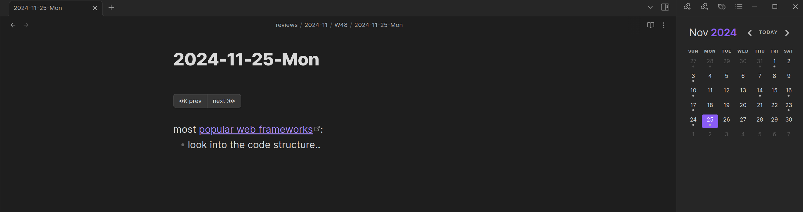
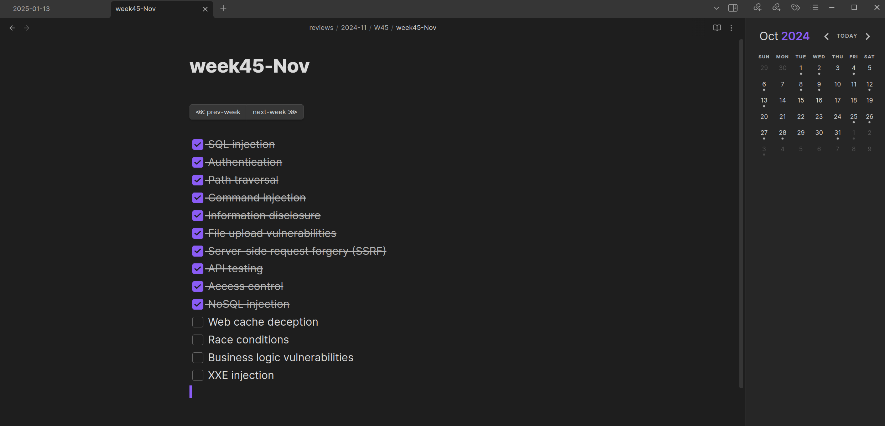
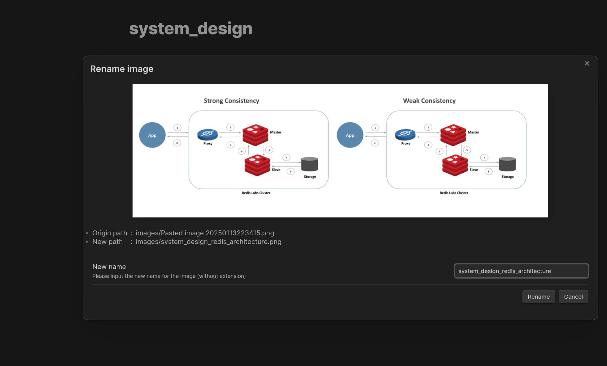

The Note-Taking Flow:

##### Daily Notes
- Open daily note (Ctrl+Shift+D)
- calender view on the sidebar
- `prev` and `next` buttons to cycle between latest daily notes taken.

##### Weekly Notes
- Identical to daily notes (Ctrl+Shift+H)
- I use it mainly for tracking weekly tasks in todo lists (usually run a weekly script that generates TODO list)
- format: weekOfYear-Month

##### Rename Image on Paste

##### Shortcuts

| **Shortcut**           | **Action**           |
|-------------------------|----------------------|
| Ctrl+Shift+D           | Open daily note      |
| Ctrl+Shift+H           | Open weekly note     |
| Ctrl+X           | Toggle Sidebar     |
| Ctrl+j           | Vim Mode Escape |

##### Folder Structure

| **Folder**           | **Content**           |
|-------------------------|----------------------|
| review           | contains daily and weekly notes      |
| templates           | contains templates     |
| images           | contains all pasted images     |
